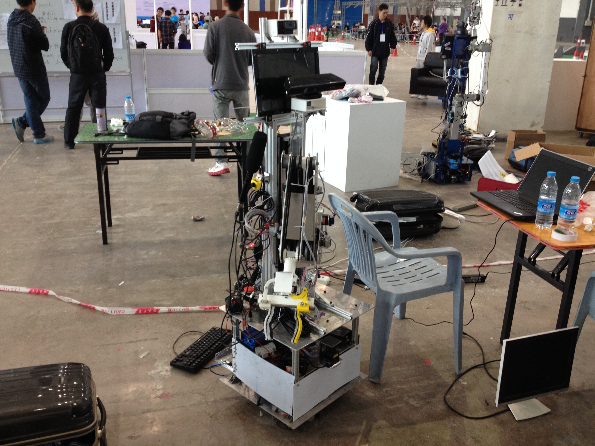
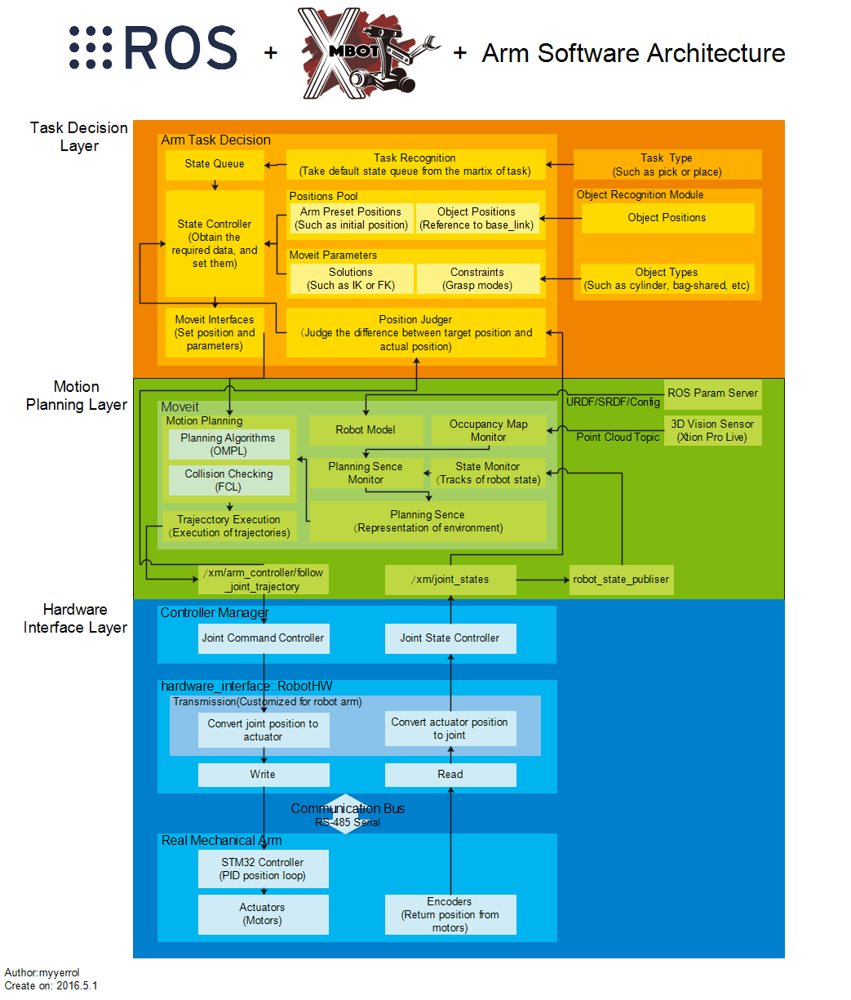
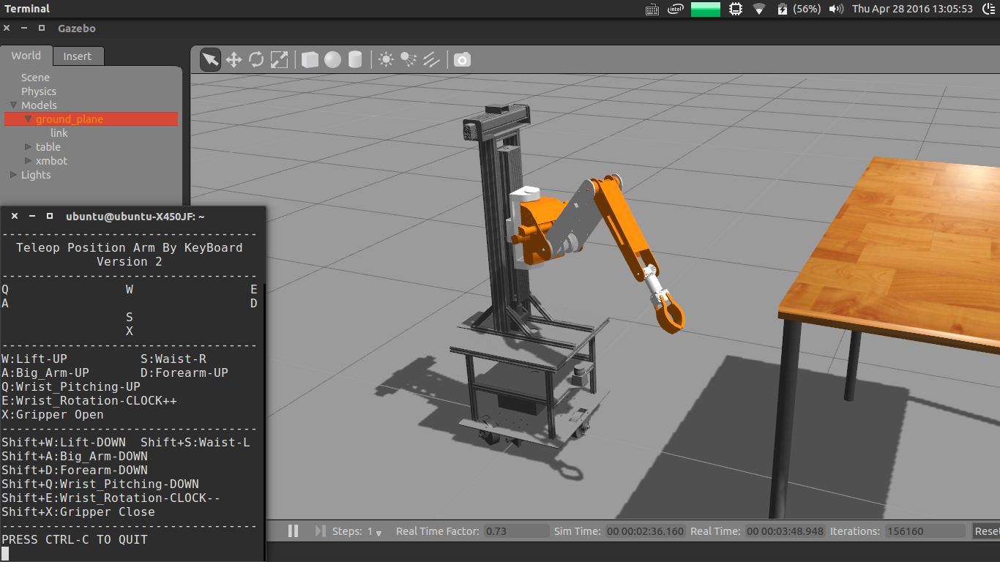
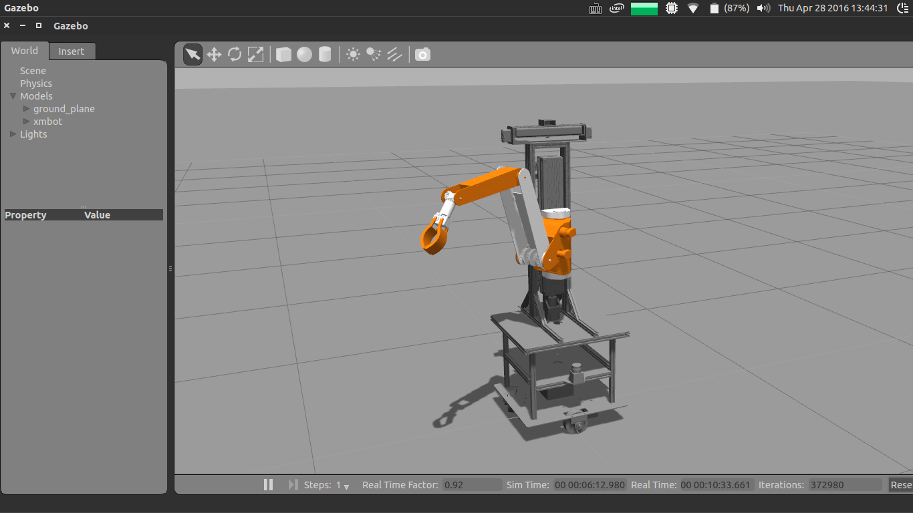

# 一、前言

HandsFree团队在其最新的[Giraffe移动机器人平台](https://github.com/HANDS-FREE/HANDS-FREE.github.io/wiki/4.3-Giraffe)上使用了HF中型机械臂，其设计原型来自于西工大舞蹈机器人基地家政组晓萌机器人的老机械臂。作为之前负责过晓萌机械臂软件部分的队员，我把自己曾经开发机械臂时所总结的一些方法和及经验分享出来，当然，写得不对的地方欢迎各位大神指正，也欢迎正在研究机械臂的大神能在此留下自己宝贵的开发经验。



# 二、技术介绍

机械臂作为机器人最为重要的执行器，赋予了机器人与外部世界环境进行物理交互的能力。这使得机器人的智能不仅仅停留在识别和规划层上，还能通过实际的操作将其真正的表达出来。目前国内外机械臂研究的热点主要集中在机械臂自主精确抓取、放置物体上，而根据本人之前的开发经历，要想让机械臂能完美地执行一系列复杂且精确的操作从而使末端执行器到达预定的位置是很难的，这需要我们理解并掌握很多与机械臂解算相关的数学知识。我相信这会让很多非专业开发者感到头疼，不过借助于第三方开源软件，比如[ROS](http://www.ros.org/)和[MoveIT！](http://moveit.ros.org/)机械臂的开发就会相对来说简单很多。下面，我分机械、电子和软件三个方面，详细地讲解一下自己在开发过程中所总结的一些技术要点。最后，你可以在[开发代码](https://github.com/myyerrol/xm_arm_workspace)（在ROS Indigo下能成功编译并运行，不支持ROS Kinetic）和[问题汇总](https://github.com/myyerrol/xm_developer_log/blob/master/xm_developer_log.md)中找到我之前整理的相关资料。

## 1、机械

我们机器人的机械臂在机械设计上有一些不一样的地方。相比于其他使用大扭矩舵机或电机作为关节的机械臂，我们使用了由同步轮和同步带所组成的机械结构，这种独特的结构使得我们的机械臂在一定程度上拥有了抓取更重物体的负载能力。除此之外，机械臂末端的手爪也由上一代的对称张开闭合的结构变成了平行夹紧的形式，即两个金属滑块可以通过在滑轨上对称平行的移动。这使得手爪可以适应不同粗细、形状的物体，为抓紧物体提供最基本的保障。当然，这个机械臂也曾经给我造成过一些小困扰，我会在下面的软件部分讲到，通过这个困扰的解决，你就可以理解为什么机械的设计在某种程度上会影响软件代码的编写。

## 2、电子

电子部分作为连接机械臂软硬件的重要组成部分，主要的任务是负责将软件组通过RS-485传过来的数据进行解析，并且以最快的速度传递给接有驱动盒的电机来实时地控制机械臂。同样的，通过电机编码器返回的数据可以用来记录每个机械臂关节的实时状态，经过一定的数学解算，就可以将其作为运动规划层的输入，为复杂运动的规划提供基本的保证。机械臂控制使用的是位置闭环算法，具体这方面我了解的并不是很多，不过之前用起来还是很稳定的。

## 3、软件



从软件架构图中可以很清楚的看到，机械臂的软件层主要由三个部分组成，从下到上依次为：硬件接口层、运动规划层和任务决策层。

### (1)、硬件接口层

机械臂硬件接口层的设计理念来源于[ROS Control](http://wiki.ros.org/ros_control)。ROS Control是ROS提供的软件与硬件之间进行数据通信的中间件，它对硬件进行了抽象，统一了数据通信的接口，并通过插件的形式封装了一些常用的运动控制算法，为建立机器人软硬件模块之间的数据通路提供了便捷。

ROS Control提供的硬件抽象层主要负责管理机器人的硬件资源，而控制器从抽象层请求资源即可，并不直接接触硬件。这提高了代码的复用率和可移植性。

首先，让我们先看一下ROS Control官方提供的数据流图是什么样子的：


细心的读者可能会发现这两个架构图在硬件接口层部分有一些不一样的地方。接下来我就讲解一下硬件接口层部分各子模块的功能，并解释彼此不同的原因。

- 实体机械臂：<br>
  这一部分指的就是真实客观存在的机械臂。STM32嵌入式控制器使用位置PID闭环算法来计算由硬件抽象层通过串口通信方式发过来的关节数据，并将计算好的数据直接发送给电机对其进行控制。同时，电机的编码器也将电机实时的位置数据经串口通信返回给上面的硬件抽象层。

- 硬件抽象层：<br>
  硬件抽象层和硬件直接打交道，通过**write**和**read**方法来完成对硬件的相关操作。硬件抽象层跟上面官方提供（红色的部分）的有一些不太一样的地方在于我并没有使用ROS Control提供的**Transmissions**（数据转换）和**Joint Limits**(关节限位）的API。原因的话，我在下面会讲到。这首先简要的介绍一下什么是Transmissions和Joint Limits。

  - Transmissions：<br>
    Transmissions就是机器人每个运动关节和电机之间的数学映射。因为机械臂关节结构的不同，会导致机器人上层规划所使用的Joint与Actuator数据之间存在明显的偏差。比如说有简单齿轮和同步带驱动的，有锥齿轮差动机构，四连杆机构等。Transmissions提供的接口中包含有解决上面这些结构进行数据转换的映射公式。

  - Joint Limits：<br>
    Joint Limits主要是维护了一个关节限位的数据结构，里面可以包含的数据种类不仅仅是常用的关节位置、速度、力矩、加速度等方面的限位，还可以储存具有安全作用的位置软限位、[位置边界](http://wiki.ros.org/pr2_controller_manager/safety_limits)和[速度边界](http://wiki.ros.org/pr2_controller_manager/safety_limits)等。

  至于我为什么没有使用以上两个模块的原因，主要是参考了**西工大一小学生**曾经在[Exbot](http://exbot.net)上发表的有关ROS Control的[文章](http://blog.exbot.net/archives/2337)。下面就截取其中的一小部分：

  > 以上两个模块是因为URDF中有相应的标签，写了一堆可以直接Load的，但是实际用处并不是很大。它的设计思想是想在URDF中表示更多的信息，这些信息在Gazebo中可以给出更多的细节。但是解析URDF的程序使得RobotHW体量很大，而且这些细节会因为机器人本体通讯暴露给ROS的细节量而不尽相同，而且还会显著提高编程复杂度，所以这些信息显得冗余，而应用这些信息的库也就显得冗余。

  之前，我是有尝试过在RobotHW中加载URDF中的相关标签，不过用起来确实就如同**小学生**所说的那样，比较麻烦，而且还很冗余。因此，我根据机械组队员提供的有关机械臂关节电机转换的数学公式封装了相应的函数，至于Joint Limits，我是在规划层的地方进行了指定。

- 控制器管理器：<br>
  控制器管理器提供一种通用的接口来管理不同的[ROS Controllers](http://wiki.ros.org/ros_controllers)，它可以加载、开始运行、停止运行、卸载不同的Controller，并且提供了多种工具来完成这些操作。[Controller Manager](http://wiki.ros.org/controller_manager)的输入就是ROS上层应用的输出。在这里面，我用到了Joint Command Controller和Joint State Controller，它们分别可以完成对每个关节的控制以及读取硬件接口中关节的状态。

---

好的。前面讲了很多新的概念，这里我们还是找个案例来具体的分析一下。这里，以我之前整理的[源码](https://github.com/myyerrol/xm_arm_workspace)作为参考，分析一下机械臂分别在[Gazebo](http://www.gazebosim.org)仿真和物理物理环境中是如何体现上面那些概念的。

首先看一张来自Gazebo官网的ROS Control架构图：


从图中可以看到，**Simulation**和**Hardware**之上的Hardware Resource和Controller Manager是一样的，这很清晰地体现了ROS Control的底层无关性，即无论使用的是抽象的仿真还是具体的硬件，只要程序能继承RobotHW硬件抽象层的基类来做到数据接口的统一，Controller Manager就可以对相应的资源进行管理。

对于**Simulation**和**Hardware**来说，它们内部架构相似，但配置以及使用方式是不一样的。**Simulation**的RobotHW部分，Gazebo官方已经将其实现，并且提供了相应的ROS Control插件来从机械臂的URDF文件中载入所需的数据。用户只需写好URDF和YAML文件，并使用ROS Launch将其整合到一起就万事大吉了。

而对于**Hardware**这部分来说，除了上面说到的配置之外，我们还需要自己编写C++代码来继承RobotHW基类，并在里面分别使用命令和状态硬件接口句柄对相应的关节数据进行**注册**，然后再将不同的硬件接口注册到RobotHW上。最后，我们还要自己编写函数完成对关节和电机数据的相互转换，并且根据指定的通信协议，实现**read**和**write**函数。

- 仿真部分：

> xm_arm_description/gazebo/xm_arm_gazebo_transmission.xacro

每个关节都添加了Hardware Interface，并且在具有父子关系的两个关节之间添加了对应的Transmission。

```xml
<?xml version="1.0"?>

<robot xmlns:xacro="http://www.ros.org/wiki/xacro">

  <transmission name="lift_simp_tran">
    <type>transmission_interface/SimpleTransmission</type>
    <joint name="joint_lift">
      <hardwareInterface>PositionJointInterface</hardwareInterface>
    </joint>
    <actuator name="lift_motor">
      <hardwareInterface>PositionJointInterface</hardwareInterface>
      <mechanicalReduction>1</mechanicalReduction>
    </actuator>
  </transmission>

  <transmission name="waist_simp_tran">
    <type>transmission_interface/SimpleTransmission</type>
    <joint name="joint_waist">
      <hardwareInterface>PositionJointInterface</hardwareInterface>
    </joint>
    <actuator name="waist_motor">
      <hardwareInterface>PositionJointInterface</hardwareInterface>
      <mechanicalReduction>1</mechanicalReduction>
    </actuator>
  </transmission>

  <transmission name="big_arm_simp_tran">
    <type>transmission_interface/SimpleTransmission</type>
    <joint name="joint_big_arm">
      <hardwareInterface>PositionJointInterface</hardwareInterface>
    </joint>
    <actuator name="big_arm_motor">
      <hardwareInterface>PositionJointInterface</hardwareInterface>
      <mechanicalReduction>1</mechanicalReduction>
    </actuator>
  </transmission>

  <transmission name="forearm_simp_tran">
    <type>transmission_interface/SimpleTransmission</type>
    <joint name="joint_forearm">
      <hardwareInterface>PositionJointInterface</hardwareInterface>
    </joint>
    <actuator name="forearm_motor">
      <hardwareInterface>PositionJointInterface</hardwareInterface>
      <mechanicalReduction>1</mechanicalReduction>
    </actuator>
  </transmission>

  <transmission name="wrist_pitching_simp_tran">
    <type>transmission_interface/SimpleTransmission</type>
    <joint name="joint_wrist_pitching">
      <hardwareInterface>PositionJointInterface</hardwareInterface>
    </joint>
    <actuator name="wrist_motor_1">
      <hardwareInterface>PositionJointInterface</hardwareInterface>
      <mechanicalReduction>1</mechanicalReduction>
    </actuator>
  </transmission>

  <transmission name="wrist_rotation_simp_tran">
    <type>transmission_interface/SimpleTransmission</type>
    <joint name="joint_wrist_rotation">
      <hardwareInterface>PositionJointInterface</hardwareInterface>
    </joint>
    <actuator name="wrist_motor_2">
      <hardwareInterface>PositionJointInterface</hardwareInterface>
      <mechanicalReduction>1</mechanicalReduction>
    </actuator>
  </transmission>

</robot>
```

> xm_arm_description/gazebo/xm_gazebo_ros_control.xacro

为了让Gazebo可以识别Transmission标签，需要添加Gazebo的ROS Control插件。

```xml
<?xml version="1.0"?>

<robot xmlns:xacro="http://www.ros.org/wiki/xacro">

  <gazebo>
    <plugin name="gazebo_ros_control" filename="libgazebo_ros_control.so">
    <robotNamespace>/xm_arm</robotNamespace>
    <robotSimType>gazebo_ros_control/DefaultRobotHWSim</robotSimType>
    </plugin>
  </gazebo>

</robot>
```

> xm_arm_gazebo_controller_config/xm_arm_gazebo_joint_position.yaml

使用YAML格式的文件来声明我们所需要使用的Controller，以及对应的参数。

```yaml
xm_arm:
  # Position Controllers
  joint_lift_position_controller:
    type: position_controllers/JointPositionController
    joint: joint_lift
    pid: {p: 100.0, i: 0.01, d: 10.0}
  joint_waist_position_controller:
    type: position_controllers/JointPositionController
    joint: joint_waist
    pid: {p: 100.0, i: 0.01, d: 10.0}
  joint_big_arm_position_controller:
    type: position_controllers/JointPositionController
    joint: joint_big_arm
    pid: {p: 100.0, i: 0.01, d: 10.0}
  joint_forearm_position_controller:
    type: position_controllers/JointPositionController
    joint: joint_forearm
    pid: {p: 100.0, i: 0.01, d: 10.0}
  joint_wrist_pitching_position_controller:
    type: position_controllers/JointPositionController
    joint: joint_wrist_pitching
    pid: {p: 100.0, i: 0.01, d: 10.0}
  joint_wrist_rotation_position_controller:
    type: position_controllers/JointPositionController
    joint: joint_wrist_rotation
    pid: {p: 100.0, i: 0.01, d: 10.0}
  joint_finger_left_position_controller:
    type: position_controllers/JointPositionController
    joint: joint_finger_left
    pid: {p: 100.0, i: 0.01, d: 10.0}
  joint_finger_right_position_controller:
    type: position_controllers/JointPositionController
    joint: joint_finger_right
    pid: {p: 100.0, i: 0.01, d: 10.0}
```

> xm_arm_gazebo_controller_config/xm_arm_gazebo_joint_states.yaml

使用Joint State Controller来发布每个关节的实时状态。

```yaml
xm_arm:
  # Publish all joint states
  joint_state_controller:
    type: joint_state_controller/JointStateController
    publish_rate: 50
```

> xm_arm_bringup/launch/xm_arm_bringup_gazebo_joint_control.launch

最后编写Launch文件来启动Controller Manager中的Spawner，加载上述插件。并启动Gazebo和Rviz载入相关的机械臂模型。

```xml
<launch>

  <!-- Launch Gazebo  -->
  <include file="$(find xm_arm_gazebo)/launch/xm_arm_empty_world.launch" />

  <!-- Load joint controller configurations from YAML file to parameter server -->
  <include file="$(find xm_arm_gazebo_controller_config)/launch/xm_arm_gazebo_joint_position.launch" />
  <include file="$(find xm_arm_gazebo_controller_config)/launch/xm_arm_gazebo_joint_states.launch" />

  <node name="rviz" pkg="rviz" type="rviz" args="-d $(find xm_arm_bringup)/rviz/xm_arm_bringup_gazebo.rviz" />

</launch>
```

在终端中输入以下命令启动Motion Control测试。

```bash
$> roslaunch xm_arm_bringup xm_arm_bringup_gazebo_joint_control.launch
$> rosrun xm_arm_teleop xm_arm_teleop_position_keyboard
```

你可以使用键盘上的按键来控制机械臂每个关节的移动位置。



- 硬件部分：

> xm_arm_robot_hardware/include/xm_arm_robot_hardware/xm_arm_robot_hardware.h

创建子类继承RobotHW父类，并且声明了一些函数和变量。

```cpp
class ArmRobotHardware : public hardware_interface::RobotHW
{
public:
    ArmRobotHardware(ros::NodeHandle nh);
    ~ArmRobotHardware();
    ros::Time getTime();
    ros::Duration getPeriod();
    ros::CallbackQueue* getCallbackQueue();
    void read(const ros::Time, const ros::Duration period);
    void write(const ros::Time, const ros::Duration period);
    bool start();
    void stop();
    double getFreq() const;
private:
    void publishArmCommand(const u_int8_t func, const u_int8_t jnt_id,
                           const float jnt_pos);
    void publishArmJState(const u_int8_t func, const u_int8_t jnt_id);
    void getArmStateCallback(
        const xm_arm_msgs::xm_ArmSerialDatagram::ConstPtr& msg);
    void getArmStatusCallback(
        const xm_arm_msgs::xm_ArmSerialDatagram::ConstPtr& msg);
    bool checkArmStatus();
    void transPositionJointToActuator();
    void transPositionActuatorToJoint();
private:
    ros::NodeHandle    nh_;
    ros::CallbackQueue callback_queue_;
    ros::Publisher     arm_serial_pub_;
    ros::Subscriber    arm_state_sub_;
    ros::Subscriber    arm_status_sub_;
    int                arm_command_id_;
    int                arm_state_id_;
    double             freq_;
    hardware_interface::JointStateInterface    jnt_state_interfece_;
    hardware_interface::PositionJointInterface jnt_position_interface_;
    hardware_interface::VelocityJointInterface jnt_velocity_interface_;
    std::vector<std::string>      jnt_name_;
    std::vector<std::string>      act_name_;
    std::map<std::string, double> jnt_pos_;
    std::map<std::string, double> jnt_vel_;
    std::map<std::string, double> jnt_eff_;
    std::map<std::string, double> act_pos_;
    std::map<std::string, double> jnt_cmd_;
    std::map<std::string, double> act_cmd_;
    std::vector<ros::Time>        jnt_stamp_;
    enum HARDWARE_STATUS {UNKNOWN, READY, RUNNING, ERROR};
    std::vector<HARDWARE_STATUS>  jnt_status_;
};
```

> xm_arm_robot_hardware/src/xm_arm_robot_hardware.cpp

初始化关节和电机数据，并使用Hardware Interface对相应的数据进行注册，最后初始化与串口通信有关的Topic。

```cpp
ArmRobotHardware::ArmRobotHardware(ros::NodeHandle nh)
    : nh_(nh),
      freq_(20)
{
    nh_.setCallbackQueue(&callback_queue_);

    jnt_name_.push_back("joint_lift");
    jnt_name_.push_back("joint_waist");
    jnt_name_.push_back("joint_big_arm");
    jnt_name_.push_back("joint_forearm");
    jnt_name_.push_back("joint_wrist_pitching");
    jnt_name_.push_back("joint_wrist_rotation");

    act_name_.push_back("actuator_lift");
    act_name_.push_back("actuator_waist");
    act_name_.push_back("actuator_big_arm");
    act_name_.push_back("actuator_forearm");
    act_name_.push_back("actuator_wrist_left");
    act_name_.push_back("actuator_wrist_right");

    for (int i = 0; i < jnt_name_.size(); i++)
    {
        jnt_pos_[jnt_name_[i]] = 0.0;
        jnt_vel_[jnt_name_[i]] = 0.0;
        jnt_eff_[jnt_name_[i]] = 0.0;
        jnt_cmd_[jnt_name_[i]] = 0.0;
        act_cmd_[act_name_[i]] = 0.0;
        act_pos_[act_name_[i]] = 0.0;

        hardware_interface::JointStateHandle jnt_state_handle(jnt_name_[i],
            &jnt_pos_[jnt_name_[i]], &jnt_vel_[jnt_name_[i]],
            &jnt_eff_[jnt_name_[i]]);
        jnt_state_interfece_.registerHandle(jnt_state_handle);
        hardware_interface::JointHandle jnt_position_handle(
            jnt_state_interfece_.getHandle(jnt_name_[i]),
            &jnt_cmd_[jnt_name_[i]]);
        jnt_position_interface_.registerHandle(jnt_position_handle);
    }

    registerInterface(&jnt_state_interfece_);
    registerInterface(&jnt_position_interface_);

    for (int i = 0; i < 6; i++)
    {
        jnt_stamp_.push_back(ros::Time::now());
        jnt_status_.push_back(UNKNOWN);
    }

    arm_command_id_ = 3;
    arm_state_id_   = 4;

    arm_serial_pub_ = nh_.advertise<xm_arm_msgs::xm_ArmSerialDatagram>(
        "xm_arm_serial/send_arm_command", 1000);
    arm_state_sub_ = nh_.subscribe("xm_arm_serial/receive_arm_state", 1000,
        &ArmRobotHardware::getArmStateCallback, this);
    arm_status_sub_ = nh_.subscribe("xm_arm_serial/receive_arm_status", 1000,
        &ArmRobotHardware::getArmStatusCallback, this);
}
```

根据机械臂公式，实现关节和电机数据之间的互相转换。

```cpp
void ArmRobotHardware::transPositionJointToActuator()
{
    act_cmd_["actuator_lift"]        = -jnt_cmd_["joint_lift"] * 100;
    act_cmd_["actuator_waist"]       =  jnt_cmd_["joint_waist"];
    act_cmd_["actuator_big_arm"]     = -jnt_cmd_["joint_big_arm"] * 1.6667;
    act_cmd_["actuator_forearm"]     = -jnt_cmd_["joint_forearm"] +
        jnt_cmd_["joint_big_arm"] * 1.6667;
    act_cmd_["actuator_wrist_left"]  = -(-jnt_cmd_["joint_big_arm"] * 1.6667 +
        jnt_cmd_["joint_forearm"] * 1.6000 + jnt_cmd_["joint_wrist_pitching"]) *
        0.6250 + jnt_cmd_["joint_wrist_rotation"] * 0.7917;
    act_cmd_["actuator_wrist_right"] = -(-jnt_cmd_["joint_big_arm"] * 1.6667 +
        jnt_cmd_["joint_forearm"] * 1.6000 + jnt_cmd_["joint_wrist_pitching"]) *
        0.6250 - jnt_cmd_["joint_wrist_rotation"] * 0.7917;
}

// Because autuator's direction is not unified, the signs of positive and
// negative may have problem in the following formula.
void ArmRobotHardware::transPositionActuatorToJoint()
{
    jnt_pos_["joint_lift"]    = -act_pos_["actuator_lift"] * 0.010;
    jnt_pos_["joint_waist"]   =  act_pos_["actuator_waist"];
    jnt_pos_["joint_big_arm"] = -act_pos_["actuator_big_arm"] * 0.600;
    jnt_pos_["joint_forearm"] = -(act_pos_["actuator_forearm"] +
        act_pos_["actuator_big_arm"]);
    jnt_pos_["joint_wrist_pitching"] = -(-act_pos_["actuator_big_arm"] * 0.6400
        - act_pos_["actuator_forearm"] * 1.6000 +
        (act_pos_["actuator_wrist_left"] + act_pos_["actuator_wrist_right"]) *
        0.8000);
    jnt_pos_["joint_wrist_rotation"] = (act_pos_["actuator_wrist_left"] -
        act_pos_["actuator_wrist_right"]) * 0.6316;
}
```

实现定制的read和write函数。

```cpp
void ArmRobotHardware::read(const ros::Time, const ros::Duration period)
{

    for (size_t i = 0; i < 6; i++)
        publishArmJState(0x01, i);

    transPositionActuatorToJoint();

    callback_queue_.callAvailable(ros::WallDuration(1 / freq_ / 3));
    ros::Time current_time = ros::Time::now();

    for (size_t i = 0; i < 6; i++)
    {
        if ((current_time - jnt_stamp_[i]).toSec() > 0.5)
        {
            ROS_WARN_STREAM("Reading timeout!");
            return ;
        }
    }
}

void ArmRobotHardware::write(const ros::Time, const ros::Duration period)
{
    transPositionJointToActuator();

    for (size_t i = 0; i < 6; i++)
        publishArmCommand(0x01, i, act_cmd_[act_name_[i]]);

    ROS_INFO_STREAM("joint_command");
    ROS_INFO_STREAM(
        "lift: "    << jnt_cmd_["joint_lift"]    << " " <<
        "waist: "   << jnt_cmd_["joint_waist"]   << " " <<
        "big_arm: " << jnt_cmd_["joint_big_arm"] << " " <<
        "forearm: " << jnt_cmd_["joint_forearm"] << " " <<
        "wrist_pitching: " << jnt_cmd_["joint_wrist_pitching"] << " " <<
        "wrist_rotation: " << jnt_cmd_["joint_wrist_rotation"] << " ");
    ROS_INFO_STREAM("------");

    callback_queue_.callAvailable(ros::WallDuration(1 / freq_ / 3));
    ros::Time current_time = ros::Time::now();

    for (size_t i = 0; i < 6; i++)
    {
        if ((current_time - jnt_stamp_[i]).toSec() > 0.5)
        {
            ROS_WARN_STREAM("Writing timeout!");
            return ;
        }
    }
}
```

> xm_arm_hardware_controller_config/config/xm_arm_hardware_joint_trajectory.yaml

Joint Trajectory Controller可以提供经过时间差值的连续关节轨迹，是MoveIT!中默认的数据接口。

```yaml
xm_arm:
  arm_controller:
    type: "position_controllers/JointTrajectoryController"
    joints:
    - joint_lift
    - joint_waist
    - joint_big_arm
    - joint_forearm
    - joint_wrist_pitching
    - joint_wrist_rotation
```

> xm_arm_hardware_controller_config/config/xm_arm_hardware_joint_states.yaml

这个与上面所仿真使用的Controller是一样的。

```yaml
xm_arm:
  joint_state_controller:
    type: joint_state_controller/JointStateController
    publish_rate: 50
```

> xm_arm_hardware_controller_config/config/xm_arm_hardware_joint_names.yaml

加载关节名字到ROS的参数服务器中。

```yaml
xm_arm:
  joint_names:
    - joint_lift
    - joint_waist
    - joint_big_arm
    - joint_forearm
    - joint_wrist_pitching
    - joint_wrist_rotation
```

以上就是硬件接口层的全部内容了。作为整个机械臂软件架构最底层的部分，它的重要性不言而喻。根据我之前开发机械臂的经验，只有编写出稳定且鲁棒的的硬件接口层，才能为之上的运动规划提供强有力的保证。否则，等到机械臂出现暴走失控的情况的时候就麻烦了（我之前就曾入过这样的坑！）。

### (2)、运动规划层

运动规划层在机械臂的自主抓取中扮演了非常重要的角色。而对于运动规划本身来说，里面涉及了非常多的专业知识，比如运动学正逆解算、碰撞检测算法、3D环境感知、动作规划算法等，以上任何一个方面都需要我们长时间的积累才能理解清楚，而对于那些想立马上手机械臂的初学者来说，这简直就是一个灾难。

而幸运的是，ROS提供了强大且易用的[MoveIt!](http://moveit.ros.org)包，它可以让你在较短的时间内实现仿真乃至实体机械臂的运动学规划演示。

首先，简要地介绍一下什么是MoveIt!。以下是MoveIt官网给出的定义：

> MoveIt! is state of the art software for mobile manipulation, incorporating the latest advances in motion planning, manipulation, 3D perception, kinematics, control and navigation. It provides an easy-to-use platform for developing advanced robotics applications, evaluating new robot designs and building integrated robotics products for industrial, commercial, R&D and other domains.

概括来说，MoveIt!是ROS中与移动操作相关的组件包的集合。它包含了运动规划、操作控制、3D感知，运动学，碰撞检测等。当然，最重要的是MoveIt!提供了非常友好的配置和调试界面。

下图是MoveIt的总体框架：


这张图我在学习MoveIt!的时候看过很多遍，理解这个架构图对于学习MoveIt!非常重要。从图中可以看到，**move_group**是MoveIt!最核心的部分。它将其他独立的组件集成到一起，为使用者提供了一系列可以使用的命令和服务。

- 用户接口：<br>
  用户可以使用C++、Python或者GUI来访问**move_group**。一般对于初学者来说，GUI和Python的使用会更多一些。

- 配置：<br>
  **move_group**本质上还是一个ROS的节点，它需要使用ROS的参数服务器来获取以下三种信息。

  - URDF：<br>
    **move_group**需要机械臂的URDF文件来进行运动规划。

  - SRDF：<br>
    **move_group**在启动时会寻找机械臂的SRDF文件，它可以通过使用MoveIt! Setup Assistant自动生成。

  - MoveIt!配置：<br>
    **move_group**在启动时会加载机械臂的关节限位、动力学、运动规划、感知以及其他相关信息。所有以上的配置信息都可以通过使用MoveIt! Setup Assistant自动生成。

- 机器人接口：<br>
  **move_group**使用ROS中的Topic和Action两种机制来与机械臂进行数据通信。它可以获取当前机械臂的位置信息，点云数据以及其他传感器数据，并且发送命令给机械臂的Controller。

  - 关节状态信息：<br>
    **move_group**会监听机械臂的/joint_states主题来获取当前的状态信息。注意：**move_group**只管监听，你需要自己给机械臂配置好[Joint State Controller](http://wiki.ros.org/joint_state_controller)。

  - 坐标转换信息：<br>
    **move_group**可以订阅机械臂的TF主题来确定机械臂内部各关节之间的位置变换关系。跟上面一样，你需要自己运行[Robot State Publier](http://wiki.ros.org/robot_state_publisher)节点来发布坐标转换。

  - 控制器接口：<br>
    **move_group**使用[Follow Joint Trajectory](http://docs.ros.org/kinetic/api/control_msgs/html/action/FollowJointTrajectory.html)类型的Action接口来与Controller进行数据通信。**move_group**自己是不带Action接口的，它是使用了一个特殊的插件来发布上述Follow Joint Trajectory类型的Action，而对于机械臂来说，你依然需要自己配置上述类型的Controller来订阅机械臂的数据。

  - 规划场景：<br>
    Planning Scene指的是机械臂本身以及其周围环境的表示。

  - 扩展能力：<br>
    **move_group**的所有组件都是以独立插件的形式实现的，而且这些插件可以通过使用ROS的参数文件或插件库来进行配置，这使得**move_group**拥有了强大的定制以及可扩展能力。

接下来，我们介绍一下**Motion Planning**。

这里我引用古月居前辈对运动规划的解释：

> 假设我们已知机器人的初始姿态和目标姿态，以及机器人和环境的模型参数，那么我们就可以通过一定的算法，在躲避环境障碍物和放置自身碰撞的同时，找到一条到达目标姿态的较优路径，这种算法就称为机器人的运动规划。机器人和环境的模型静态参数由URDF文件提供，在默写场景下还需要加入3D摄像头、激光雷达来动态检测环境变化，避免与动态障碍物发生碰撞。

在MoveIt!中，运动规划算法是由运动规划器算出来的。当然，运动规划算法有很多，每一个运动规划器都是MoveIt的一个插件，可以根据需求选用不同的规划算法。MoveIt!默认使用的是[OMPL](http://ompl.kavrakilab.org)。OMPL(Open Motion Planning Library)是开源运动规划库的简写，它提供基于随机化的运动规划器。


- 运动规划请求：<br>
  在让运动规划器进行运动规划之前，我们要先发送一个运动规划的请求。这个请求可以是新的机械臂或末端执行器的位置。为了让运动规划器规划出来的轨迹符合要求，我们需要指定一些约束条件：

  - 位置约束：<br>
    约束机械臂Link的位置。

  - 方向约束：<br>
    约束机械臂Link的方向。

  - 可见性约束：<br>
    约束Link上的某点在某些区域的可见性。

  - 关节约束：<br>
    约束Joint的运动范围。

  - 自定义约束：<br>
    使用自定义的回调函数来指定约束条件。

- 运动规划结果：<br>
  **move_group**节点最终将会根据上面的运动规划请求，生成一条运动轨迹。这条轨迹可以使机械臂移动到预想的目标位置。请注意：**move_group**输出的是一条轨迹，而不是路径。对于机械臂来说，路径是使末端执行器移动到目标位置的过程中，中间所经历的一系列独立的位置点。而轨迹则是在路径的基础上，通过加入速度、加速度约束以及时间参数来使机械臂运动的更加平滑。

- 规划请求适配器：<br>
  在运动规划器的输入输出端分别有两个规划请求适配器。它们的作用分别是对规划请求和规划结果进行预处理和后期处理。MoveIt!提供了几种默认的适配器来完成一些特定的功能。

  - FixStartStateBounds:<br>
    当机械臂的一个或多个关节的初始状态**稍微**超出了URDF文件中所定义的Joint Limits后，为了能让运动规划器可以运行，FixStartStateBounds适配器会通过将关节状态移动到Joint Limits处来解决这个问题。不过，如果机械臂关节的偏差很大的话，这种靠软件方式修正的方式就不适用了。

  - FixWorkspaceBounds:<br>
    这个适配器会默认地生成一个10x10x10立方米的机械臂规划空间。

  - FixStartStateCollision:<br>
    如果已有的关节配置文件会导致碰撞，这个适配器可以采样新的配置文件，并根据摇摆因子来修改已有的配置文件，从而保证新的机械臂不会发生碰撞。

  - FixStartStatePathConstraints:<br>
    如果机械臂的初始姿态不满足路径约束，这个适配器可以找到附近满足约束的姿态作为机械臂的初始姿态。

  - AddTimeParameterization:<br>
    这个适配器非常重要。它把从运动规划器中输出的空间路径按等距离进行划分，并在其中添加加速度、加速度约束，以及时间戳等必要信息。

**Planning Scene**


Planning Scene用来表示机械臂周围的外部世界并且保存机械臂自己本身的状态。它通过监听对应的Topic来获取关节状态信息、传感器信息。并可以根据传感器信息和用户的输入，生成机器人周围3D世界空间的表示。

**3D Perception**


简单来说，3D Perception使用插件来获取点云和深度图像数据，并据此生成[OctoMap](http://octomap.github.io)，为之后机械臂的碰撞检测提供基础。

**Kinematics**

运动学算法是机械臂各种算法中的核心，尤其是反向运动学算法IK(Inverse Kinematics)。MoveIt!使用插件的形式可以让用户灵活的选择需要使用的反向运动学算法，也可以选择自己的算法。

**Collision Checking**

MoveIt!使用CollisionWorld对象进行碰撞检测，采用[FCL](http://gamma.cs.unc.edu/FCL/fcl_docs/webpage/generated/index.html)(Flexible Collision Library)功能包。碰撞检测是运动规划中最耗时的运算，往往会占用90%左右的时间，为了减少计算量，可以通过设置ACM(Allowed Collision Matrix)来进行优化。

---

好的，讲了这么多抽象的概念，就让我们像上一节讲ROS Control一样，用具体的例子来实践一下。

首先，你需要机械臂的URDF文件，而且保证里面所包含的Link(连杆)、Joint(关节)、运动学参数、动力学参数、可视化和碰撞模型没有问题。这里要注意一下，通过[SolidWorks插件](http://wiki.ros.org/sw_urdf_exporter)导出的URDF文件，它默认使用的碰撞检测模型和可视化模型是一样的。为了提高运动规划的执行速度，你可以使用[MeshLab](http://www.meshlab.net)来简化模型（.stl或.dae零件）的点和面。

> xm_arm_description/urdf/xmbot_with_arm.urdf.xacro

```xml
<?xml version="1.0"?>

<robot name="xmbot" xmlns:xacro="http://www.ros.org/wiki/xacro">

  <!-- The following xacro:include files set up definitions of parts of the robot body -->
  <xacro:include filename="$(find xm_arm_description)/urdf/materials.urdf.xacro" />
  <xacro:include filename="$(find xm_arm_description)/urdf/xm_base.urdf.xacro" />
  <xacro:include filename="$(find xm_arm_description)/urdf/xm_wheel.urdf.xacro" />
  <xacro:include filename="$(find xm_arm_description)/urdf/xm_arm.urdf.xacro" />
  <xacro:include filename="$(find xm_arm_description)/urdf/xm_gripper.urdf.xacro" />
  <xacro:include filename="$(find xm_arm_description)/urdf/xm_kinect.urdf.xacro" />
  <xacro:include filename="$(find xm_arm_description)/urdf/xm_laser.urdf.xacro" />

  <!-- Attach the base -->
  <base name="base" color="DarkGrey" />

  <!-- Add the drive wheels -->
  <wheel parent="base" suffix="1" color="DarkGrey" type="fixed"
         origin_xyz="0.19419 0.00022708 -0.042" origin_rpy="-1.5708 0 -1.5708"
         inert_origin_xyz="8.0491E-16 -1.3878E-17 -0.0042221"
         inert_ixx="0.00030696" inert_ixy="-3.4634E-22" inert_ixz="-7.3136E-19"
         inert_iyy="0.00030696" inert_iyz="8.9342E-21" inert_izz="0.00029643" />
  <wheel parent="base" suffix="2" color="DarkGrey" type="fixed"
         origin_xyz="-0.096968 -0.16833 -0.042" origin_rpy="-1.5708 0 2.618"
         inert_origin_xyz="-1.3878E-17 1.3878E-17 -0.0042221"
         inert_ixx="0.00030696" inert_ixy="1.0391E-20" inert_ixz="1.3553E-20"
         inert_iyy="0.00030696" inert_iyz="4.616E-21" inert_izz="0.00029643" />
  <wheel parent="base" suffix="3" color="DarkGrey" type="fixed"
         origin_xyz="-0.097362 0.1681 -0.042"   origin_rpy="-1.5708 0 0.5236"
         inert_origin_xyz="1.4572E-15 0 -0.0042221"
         inert_ixx="0.00030696" inert_ixy="-3.3256E-21" inert_ixz="2.7105E-20"
         inert_iyy="0.00030696" inert_iyz="-1.1933E-20" inert_izz="0.00029643" />

  <!-- Attach the arm -->
  <lift  name="lift"  parent="base" color="OffWhite" />
  <waist name="waist" parent="lift" color="Orange" />
  <big_arm name="big_arm" parent="waist" color="OffWhite" />
  <forearm name="forearm" parent="big_arm" color="Orange" />
  <wrist_pitching name="wrist_pitching" parent="forearm" color="OffWhite" />
  <wrist_rotation name="wrist_rotation" parent="wrist_pitching" color="OffWhite" />

  <!-- Attach the gripper -->
  <finger_left  name="finger_left"  parent="wrist_rotation" color="Orange" type="revolute" />
  <finger_right name="finger_right" parent="wrist_rotation" color="Orange" type="revolute" />
  <gripper_frame name="gripper_frame" parent="wrist_rotation" color="OffWhite" type="fixed" />

  <!-- Attach the kinect -->
  <head_kinect name="kinect" parent="base" color="DarkGrey" type="fixed" />

  <!-- Attach the laser -->
  <laser name="laser" parent="base" color="DarkGrey" />

</robot>
```

之后，运行下面命令来启动MoveIt! Setup Assistant。

```bash
rosrun moveit_setup_assistant moveit_setup_assistant
```


之后你可以根据[MoveIt! Setaup Assistant官网教程](http://docs.ros.org/kinetic/api/moveit_tutorials/html/doc/setup_assistant/setup_assistant_tutorial.html)完成机械臂的配置。虽然这里我没有详细讲解配置的每一步（其实是我忘了截图），但这一步是非常重要的。我之前就配置过很多次，但总有问题。所以说配置机械臂MoveIt!参数是需要一定经验的。这里，我主要讲两个我在配置过程中遇到的问题，希望对你有所帮助。

- 交互式Marker没有在末端执行器上生成：<br>
  这个问题曾经困扰了我很久，后来我在Google上搜索了一段时间，终于找到问题的原因和解决办法。出现这个问题的原因是我在配置末端执行器的时候，**parent_link**没有选择**arm**组中的link，而是选了**gripper**组中的。因此，解决办法就是选择**arm**组中的最顶端的link填入到**parent_link**中就没问题了。

- MoveIt!根据点云数据生成的OctoMap在Rviz中的位置、方向与实际不符：<br>
  这个问题的原因，你可以通过可视化Rviz中的TF插件来看到。每个Link都有自己的XYZ方向，如果你机器人的Camera Link的XYZ方向恰好与Rviz所使用的XYZ方向不符，就会出现上述问题。我的解决办法是在URDF中再添加一个或两个虚拟的Link来修正方向上的偏差。

打开用MoveIt! Setup Assistant生成的包，我们可以发现里面有config和launch两个文件夹。这里简要介绍下每个文件的功能。

> xm_arm_moveit_config/config/controllers.yaml

这个文件指定了MoveIt!向Controller发布数据的接口。注意：这个配置文件不是用MoveIt! Setup Assistant自动生成的，你需要自己添加。而且**name**要与[Controller配置文件](https://github.com/myyerrol/xm_arm_workspace/blob/master/xm_arm_hardware_controller_config/config/xm_arm_hardware_joint_trajectory.yaml)的**namespace**保持一致。否则，MoveIt!输出的轨迹是没法传送给物理机械臂的。

```yaml
controller_list:
  - name: xm_arm/arm_controller
    action_ns: follow_joint_trajectory
    type: FollowJointTrajectory
    default: true
    joints:
      - joint_lift
      - joint_waist
      - joint_big_arm
      - joint_forearm
      - joint_wrist_pitching
      - joint_wrist_rotation
```

> xm_arm_moveit_config/config/fake_controllers.yaml

这是虚拟控制器配置文件，方便我们在没有实体机械臂，甚至没有任何模拟器开启的情况下也能运行MoveIt!。

```yaml
controller_list:
  - name: fake_xm_arm_controller
    joints:
      - joint_lift
      - joint_waist
      - joint_big_arm
      - joint_forearm
      - joint_wrist_pitching
      - joint_wrist_rotation
  - name: fake_xm_gripper_controller
    joints:
      - joint_finger_left
      - joint_finger_right
```

> xm_arm_moveit_config/config/joint_limits.yaml

这里记录了机械臂各关节的位置、速度、加速度的极限。

```yaml
# joint_limits.yaml allows the dynamics properties specified in the URDF to be overwritten or augmented as needed
# Specific joint properties can be changed with the keys [max_position, min_position, max_velocity, max_acceleration]
# Joint limits can be turned off with [has_velocity_limits, has_acceleration_limits]
joint_limits:
  joint_big_arm:
    has_velocity_limits: true
    max_velocity: 1
    has_acceleration_limits: false
    max_acceleration: 0
  joint_finger_left:
    has_velocity_limits: true
    max_velocity: 1
    has_acceleration_limits: false
    max_acceleration: 0
  joint_finger_right:
    has_velocity_limits: true
    max_velocity: 1
    has_acceleration_limits: false
    max_acceleration: 0
  joint_forearm:
    has_velocity_limits: true
    max_velocity: 1
    has_acceleration_limits: false
    max_acceleration: 0
  joint_lift:
    has_velocity_limits: true
    max_velocity: 1
    has_acceleration_limits: false
    max_acceleration: 0
  joint_waist:
    has_velocity_limits: true
    max_velocity: 1
    has_acceleration_limits: false
    max_acceleration: 0
  joint_wrist_pitching:
    has_velocity_limits: true
    max_velocity: 1
    has_acceleration_limits: false
    max_acceleration: 0
  joint_wrist_rotation:
    has_velocity_limits: true
    max_velocity: 1
    has_acceleration_limits: false
    max_acceleration: 0
```

> xm_arm_moveit_config/config/kinematics.yaml

记录运动规划的配置参数。

```yaml
xm_arm:
  kinematics_solver: kdl_kinematics_plugin/KDLKinematicsPlugin
  kinematics_solver_search_resolution: 0.005
  kinematics_solver_timeout: 0.05
  kinematics_solver_attempts: 3
```

> xm_arm_moveit_config/config/ompl_planning.yaml

记录了OMPL算法的各种配置参数。

```yaml
planner_configs:
  SBLkConfigDefault:
    type: geometric::SBL
    range: 0.0  # Max motion added to tree. ==> maxDistance_ default: 0.0, if 0.0, set on setup()
  ESTkConfigDefault:
    type: geometric::EST
    range: 0.0  # Max motion added to tree. ==> maxDistance_ default: 0.0, if 0.0 setup()
    goal_bias: 0.05  # When close to goal select goal, with this probability. default: 0.05
  LBKPIECEkConfigDefault:
    type: geometric::LBKPIECE
    range: 0.0  # Max motion added to tree. ==> maxDistance_ default: 0.0, if 0.0, set on setup()
    border_fraction: 0.9  # Fraction of time focused on boarder default: 0.9
    min_valid_path_fraction: 0.5  # Accept partially valid moves above fraction. default: 0.5
  BKPIECEkConfigDefault:
    type: geometric::BKPIECE
    range: 0.0  # Max motion added to tree. ==> maxDistance_ default: 0.0, if 0.0, set on setup()
    border_fraction: 0.9  # Fraction of time focused on boarder default: 0.9
    failed_expansion_score_factor: 0.5  # When extending motion fails, scale score by factor. default: 0.5
    min_valid_path_fraction: 0.5  # Accept partially valid moves above fraction. default: 0.5
  KPIECEkConfigDefault:
    type: geometric::KPIECE
    range: 0.0  # Max motion added to tree. ==> maxDistance_ default: 0.0, if 0.0, set on setup()
    goal_bias: 0.05  # When close to goal select goal, with this probability. default: 0.05
    border_fraction: 0.9  # Fraction of time focused on boarder default: 0.9 (0.0,1.]
    failed_expansion_score_factor: 0.5  # When extending motion fails, scale score by factor. default: 0.5
    min_valid_path_fraction: 0.5  # Accept partially valid moves above fraction. default: 0.5
  RRTkConfigDefault:
    type: geometric::RRT
    range: 0.0  # Max motion added to tree. ==> maxDistance_ default: 0.0, if 0.0, set on setup()
    goal_bias: 0.05  # When close to goal select goal, with this probability? default: 0.05
  RRTConnectkConfigDefault:
    type: geometric::RRTConnect
    range: 0.0  # Max motion added to tree. ==> maxDistance_ default: 0.0, if 0.0, set on setup()
  RRTstarkConfigDefault:
    type: geometric::RRTstar
    range: 0.0  # Max motion added to tree. ==> maxDistance_ default: 0.0, if 0.0, set on setup()
    goal_bias: 0.05  # When close to goal select goal, with this probability? default: 0.05
    delay_collision_checking: 1  # Stop collision checking as soon as C-free parent found. default 1
  TRRTkConfigDefault:
    type: geometric::TRRT
    range: 0.0  # Max motion added to tree. ==> maxDistance_ default: 0.0, if 0.0, set on setup()
    goal_bias: 0.05  # When close to goal select goal, with this probability? default: 0.05
    max_states_failed: 10  # when to start increasing temp. default: 10
    temp_change_factor: 2.0  # how much to increase or decrease temp. default: 2.0
    min_temperature: 10e-10  # lower limit of temp change. default: 10e-10
    init_temperature: 10e-6  # initial temperature. default: 10e-6
    frountier_threshold: 0.0  # dist new state to nearest neighbor to disqualify as frontier. default: 0.0 set in setup()
    frountierNodeRatio: 0.1  # 1/10, or 1 nonfrontier for every 10 frontier. default: 0.1
    k_constant: 0.0  # value used to normalize expresssion. default: 0.0 set in setup()
  PRMkConfigDefault:
    type: geometric::PRM
    max_nearest_neighbors: 10  # use k nearest neighbors. default: 10
  PRMstarkConfigDefault:
    type: geometric::PRMstar
xm_arm:
  planner_configs:
    - SBLkConfigDefault
    - ESTkConfigDefault
    - LBKPIECEkConfigDefault
    - BKPIECEkConfigDefault
    - KPIECEkConfigDefault
    - RRTkConfigDefault
    - RRTConnectkConfigDefault
    - RRTstarkConfigDefault
    - TRRTkConfigDefault
    - PRMkConfigDefault
    - PRMstarkConfigDefault
  projection_evaluator: joints(joint_lift,joint_waist)
  longest_valid_segment_fraction: 0.05
xm_gripper:
  planner_configs:
    - SBLkConfigDefault
    - ESTkConfigDefault
    - LBKPIECEkConfigDefault
    - BKPIECEkConfigDefault
    - KPIECEkConfigDefault
    - RRTkConfigDefault
    - RRTConnectkConfigDefault
    - RRTstarkConfigDefault
    - TRRTkConfigDefault
    - PRMkConfigDefault
    - PRMstarkConfigDefault
  projection_evaluator: joints(joint_finger_left,joint_finger_right)
  longest_valid_segment_fraction: 0.05
```

> xm_arm_moveit_config/config/sensors_rgbd.yaml

这个文件用来配置MoveIt!的传感器插件，它可以使MoveIt!订阅点云数据来生成机械臂避障用的OctoMap。注意：这个配置文件不是用MoveIt! Setup Assistant自动生成的，你需要自己添加。

```yaml
sensors:
- sensor_plugin: occupancy_map_monitor/PointCloudOctomapUpdater
  point_cloud_topic: /head_kinect/depth/points
  max_range: 10
  padding_offset: 0.01
  padding_scale: 1.0
  point_subsample: 1
  filtered_cloud_topic: output_cloud
```

> xm_arm_moveit_config/config/xmbot.srdf

这是MoveIt!的主配置文件。这里面记录了我们使用MoveIt! Setup Assistant配置时的参数，里面包含了组群、位姿、末端执行器、虚拟关节，以及碰撞免测矩阵的定义。

```xml
<?xml version="1.0" ?>
<!--This does not replace URDF, and is not an extension of URDF.
    This is a format for representing semantic information about the robot structure.
    A URDF file must exist for this robot as well, where the joints and the links that are referenced are defined
-->
<robot name="xmbot">
    <!--GROUPS: Representation of a set of joints and links. This can be useful for specifying DOF to plan for, defining arms, end effectors, etc-->
    <!--LINKS: When a link is specified, the parent joint of that link (if it exists) is automatically included-->
    <!--JOINTS: When a joint is specified, the child link of that joint (which will always exist) is automatically included-->
    <!--CHAINS: When a chain is specified, all the links along the chain (including endpoints) are included in the group. Additionally, all the joints that are parents to included links are also included. This means that joints along the chain and the parent joint of the base link are included in the group-->
    <!--SUBGROUPS: Groups can also be formed by referencing to already defined group names-->
    <group name="xm_arm">
        <joint name="joint_lift" />
        <joint name="joint_waist" />
        <joint name="joint_big_arm" />
        <joint name="joint_forearm" />
        <joint name="joint_wrist_pitching" />
        <joint name="joint_wrist_rotation" />
        <chain base_link="link_lift" tip_link="link_gripper_frame" />
    </group>
    <group name="xm_gripper">
        <link name="link_finger_left" />
        <link name="link_finger_right" />
        <joint name="joint_finger_left" />
        <joint name="joint_finger_right" />
    </group>
    <!--GROUP STATES: Purpose: Define a named state for a particular group, in terms of joint values. This is useful to define states like 'folded arms'-->
    <group_state name="initial" group="xm_arm">
        <joint name="joint_big_arm" value="1.309" />
        <joint name="joint_forearm" value="2.182" />
        <joint name="joint_lift" value="0" />
        <joint name="joint_waist" value="-0.96" />
        <joint name="joint_wrist_pitching" value="0" />
        <joint name="joint_wrist_rotation" value="0" />
    </group_state>
    <group_state name="prepare" group="xm_arm">
        <joint name="joint_big_arm" value="1.309" />
        <joint name="joint_forearm" value="2.182" />
        <joint name="joint_lift" value="0" />
        <joint name="joint_waist" value="0" />
        <joint name="joint_wrist_pitching" value="0" />
        <joint name="joint_wrist_rotation" value="0" />
    </group_state>
    <group_state name="straight" group="xm_arm">
        <joint name="joint_big_arm" value="0" />
        <joint name="joint_forearm" value="0" />
        <joint name="joint_lift" value="0" />
        <joint name="joint_waist" value="0" />
        <joint name="joint_wrist_pitching" value="0" />
        <joint name="joint_wrist_rotation" value="0" />
    </group_state>
    <!--END EFFECTOR: Purpose: Represent information about an end effector.-->
    <end_effector name="xm_effector" parent_link="link_gripper_frame" group="xm_gripper" parent_group="xm_arm" />
    <!--VIRTUAL JOINT: Purpose: this element defines a virtual joint between a robot link and an external frame of reference (considered fixed with respect to the robot)-->
    <virtual_joint name="base_odom" type="fixed" parent_frame="odom" child_link="base_footprint" />
    <!--DISABLE COLLISIONS: By default it is assumed that any link of the robot could potentially come into collision with any other link in the robot. This tag disables collision checking between a specified pair of links. -->
    <disable_collisions link1="base_footprint" link2="base_link" reason="Adjacent" />
    <disable_collisions link1="base_footprint" link2="link_big_arm" reason="Never" />
    <disable_collisions link1="base_footprint" link2="link_kinect" reason="Never" />
    <disable_collisions link1="base_footprint" link2="link_laser" reason="Never" />
    <disable_collisions link1="base_footprint" link2="link_lift" reason="Never" />
    <disable_collisions link1="base_footprint" link2="link_waist" reason="Never" />
    <disable_collisions link1="base_footprint" link2="link_wheel_1" reason="Never" />
    <disable_collisions link1="base_footprint" link2="link_wheel_2" reason="Never" />
    <disable_collisions link1="base_footprint" link2="link_wheel_3" reason="Never" />
    <disable_collisions link1="base_link" link2="link_kinect" reason="Adjacent" />
    <disable_collisions link1="base_link" link2="link_laser" reason="Adjacent" />
    <disable_collisions link1="base_link" link2="link_lift" reason="Adjacent" />
    <disable_collisions link1="base_link" link2="link_waist" reason="Never" />
    <disable_collisions link1="base_link" link2="link_wheel_1" reason="Adjacent" />
    <disable_collisions link1="base_link" link2="link_wheel_2" reason="Adjacent" />
    <disable_collisions link1="base_link" link2="link_wheel_3" reason="Adjacent" />
    <disable_collisions link1="link_big_arm" link2="link_finger_left" reason="Never" />
    <disable_collisions link1="link_big_arm" link2="link_finger_right" reason="Never" />
    <disable_collisions link1="link_big_arm" link2="link_forearm" reason="Adjacent" />
    <disable_collisions link1="link_big_arm" link2="link_kinect" reason="Never" />
    <disable_collisions link1="link_big_arm" link2="link_lift" reason="Never" />
    <disable_collisions link1="link_big_arm" link2="link_waist" reason="Adjacent" />
    <disable_collisions link1="link_big_arm" link2="link_wheel_1" reason="Never" />
    <disable_collisions link1="link_big_arm" link2="link_wheel_2" reason="Never" />
    <disable_collisions link1="link_big_arm" link2="link_wheel_3" reason="Never" />
    <disable_collisions link1="link_big_arm" link2="link_wrist_pitching" reason="Never" />
    <disable_collisions link1="link_big_arm" link2="link_wrist_rotation" reason="Never" />
    <disable_collisions link1="link_finger_left" link2="link_finger_right" reason="Never" />
    <disable_collisions link1="link_finger_left" link2="link_wrist_pitching" reason="Never" />
    <disable_collisions link1="link_finger_left" link2="link_wrist_rotation" reason="Adjacent" />
    <disable_collisions link1="link_finger_right" link2="link_wrist_pitching" reason="Never" />
    <disable_collisions link1="link_finger_right" link2="link_wrist_rotation" reason="Adjacent" />
    <disable_collisions link1="link_forearm" link2="link_waist" reason="Never" />
    <disable_collisions link1="link_forearm" link2="link_wheel_2" reason="Never" />
    <disable_collisions link1="link_forearm" link2="link_wheel_3" reason="Never" />
    <disable_collisions link1="link_forearm" link2="link_wrist_pitching" reason="Adjacent" />
    <disable_collisions link1="link_forearm" link2="link_wrist_rotation" reason="Never" />
    <disable_collisions link1="link_kinect" link2="link_laser" reason="Never" />
    <disable_collisions link1="link_kinect" link2="link_lift" reason="Never" />
    <disable_collisions link1="link_kinect" link2="link_waist" reason="Never" />
    <disable_collisions link1="link_kinect" link2="link_wheel_1" reason="Never" />
    <disable_collisions link1="link_kinect" link2="link_wheel_2" reason="Never" />
    <disable_collisions link1="link_kinect" link2="link_wheel_3" reason="Never" />
    <disable_collisions link1="link_laser" link2="link_lift" reason="Never" />
    <disable_collisions link1="link_laser" link2="link_waist" reason="Never" />
    <disable_collisions link1="link_laser" link2="link_wheel_1" reason="Never" />
    <disable_collisions link1="link_laser" link2="link_wheel_2" reason="Never" />
    <disable_collisions link1="link_laser" link2="link_wheel_3" reason="Never" />
    <disable_collisions link1="link_lift" link2="link_waist" reason="Adjacent" />
    <disable_collisions link1="link_lift" link2="link_wheel_1" reason="Never" />
    <disable_collisions link1="link_lift" link2="link_wheel_2" reason="Never" />
    <disable_collisions link1="link_lift" link2="link_wheel_3" reason="Never" />
    <disable_collisions link1="link_lift" link2="link_wrist_pitching" reason="Never" />
    <disable_collisions link1="link_waist" link2="link_wheel_1" reason="Never" />
    <disable_collisions link1="link_waist" link2="link_wheel_2" reason="Never" />
    <disable_collisions link1="link_waist" link2="link_wheel_3" reason="Never" />
    <disable_collisions link1="link_waist" link2="link_wrist_pitching" reason="Never" />
    <disable_collisions link1="link_wheel_1" link2="link_wheel_2" reason="Never" />
    <disable_collisions link1="link_wheel_1" link2="link_wheel_3" reason="Never" />
    <disable_collisions link1="link_wheel_2" link2="link_wheel_3" reason="Never" />
    <disable_collisions link1="link_wheel_2" link2="link_wrist_pitching" reason="Never" />
    <disable_collisions link1="link_wheel_3" link2="link_wrist_pitching" reason="Never" />
    <disable_collisions link1="link_wheel_3" link2="link_wrist_rotation" reason="Never" />
    <disable_collisions link1="link_wrist_pitching" link2="link_wrist_rotation" reason="Adjacent" />
</robot>
```

下面，我们打开launch文件夹，你会发现里面有很多launch和xml文件。这时候不要慌，因为MoveIt!的模块化设计思想，它将不同的功能进行拆分并放到不同的文件中，所以文件看起来很多，但每一个都不是很长。这里，我只介绍其中几个重要的文件。

> xm_arm_moveit_config/launch/demo.launch

这个launch文件是运行MoveIt!的根节点，它里面还包含了其他的launch文件。包括最为重要的move_group.launch。

```xml
<launch>

  <!-- By default, we do not start a database (it can be large) -->
  <arg name="db" default="false" />

  <!-- By default, we are not in debug mode -->
  <arg name="debug" default="false" />

  <!-- Load the URDF, SRDF and other .yaml configuration files on the param server -->
  <include file="$(find xm_arm_moveit_config)/launch/planning_context.launch">
    <arg name="load_robot_description" value="true"/>
  </include>

  <!-- If needed, broadcast static tf for robot root -->


  <!-- We do not have a robot connected, so publish fake joint states -->
  <node name="joint_state_publisher" pkg="joint_state_publisher" type="joint_state_publisher">
    <param name="/use_gui" value="false"/>
    <rosparam param="/source_list">[/move_group/fake_controller_joint_states]</rosparam>
  </node>

  <!-- Given the published joint states, publish tf for the robot links -->
  <node name="robot_state_publisher" pkg="robot_state_publisher" type="robot_state_publisher" respawn="true" output="screen" />

  <!-- Run the main MoveIt executable without trajectory execution (we do not have controllers configured by default) -->
  <include file="$(find xm_arm_moveit_config)/launch/move_group.launch">
    <arg name="allow_trajectory_execution" value="true"/>
    <arg name="fake_execution" value="true"/>
    <arg name="info" value="true"/>
    <arg name="debug" value="$(arg debug)"/>
  </include>

  <!-- Run Rviz and load the default config to see the state of the move_group node -->
  <include file="$(find xm_arm_moveit_config)/launch/moveit_rviz.launch">
    <arg name="config" value="true"/>
    <arg name="debug" value="$(arg debug)"/>
  </include>

  <!-- If database loading was enabled, start mongodb as well -->
  <include file="$(find xm_arm_moveit_config)/launch/default_warehouse_db.launch" if="$(arg db)"/>

</launch>
```

> xm_arm_moveit_config/launch/move_group.launch

这个launch文件里面设置了很多运动规划时的参数。

```xml
<launch>

  <include file="$(find xm_arm_moveit_config)/launch/planning_context.launch" />

  <!-- GDB Debug Option -->
  <arg name="debug" default="false" />
  <arg unless="$(arg debug)" name="launch_prefix" value="" />
  <arg     if="$(arg debug)" name="launch_prefix"
	   value="gdb -x $(find xm_arm_moveit_config)/launch/gdb_settings.gdb --ex run --args" />

  <!-- Verbose Mode Option -->
  <arg name="info" default="$(arg debug)" />
  <arg unless="$(arg info)" name="command_args" value="" />
  <arg     if="$(arg info)" name="command_args" value="--debug" />

  <!-- move_group settings -->
  <arg name="allow_trajectory_execution" default="true"/>
  <arg name="fake_execution" default="false"/>
  <arg name="max_safe_path_cost" default="1"/>
  <arg name="jiggle_fraction" default="0.05" />
  <arg name="publish_monitored_planning_scene" default="true"/>

  <!-- Planning Functionality -->
  <include ns="move_group" file="$(find xm_arm_moveit_config)/launch/planning_pipeline.launch.xml">
    <arg name="pipeline" value="ompl" />
  </include>

  <!-- Trajectory Execution Functionality -->
  <include ns="move_group" file="$(find xm_arm_moveit_config)/launch/trajectory_execution.launch.xml" if="$(arg allow_trajectory_execution)">
    <arg name="moveit_manage_controllers" value="true" />
    <arg name="moveit_controller_manager" value="xmbot" unless="$(arg fake_execution)"/>
    <arg name="moveit_controller_manager" value="fake" if="$(arg fake_execution)"/>
  </include>

  <!-- Sensors Functionality -->
  <include ns="move_group" file="$(find xm_arm_moveit_config)/launch/sensor_manager.launch.xml" if="$(arg allow_trajectory_execution)">
    <arg name="moveit_sensor_manager" value="xmbot" />
  </include>

  <!-- Start the actual move_group node/action server -->
  <node name="move_group" launch-prefix="$(arg launch_prefix)" pkg="moveit_ros_move_group" type="move_group" respawn="false" output="screen" args="$(arg command_args)">
    <!-- Set the display variable, in case OpenGL code is used internally -->
    <env name="DISPLAY" value="$(optenv DISPLAY :0)" />

    <param name="allow_trajectory_execution" value="$(arg allow_trajectory_execution)"/>
    <param name="max_safe_path_cost" value="$(arg max_safe_path_cost)"/>
    <param name="jiggle_fraction" value="$(arg jiggle_fraction)" />

    <!-- MoveGroup capabilities to load -->
    <param name="capabilities" value="move_group/MoveGroupCartesianPathService
				      move_group/MoveGroupExecuteService
				      move_group/MoveGroupKinematicsService
				      move_group/MoveGroupMoveAction
				      move_group/MoveGroupPickPlaceAction
				      move_group/MoveGroupPlanService
				      move_group/MoveGroupQueryPlannersService
				      move_group/MoveGroupStateValidationService
				      move_group/MoveGroupGetPlanningSceneService
				      move_group/ClearOctomapService
				      " />

    <!-- Publish the planning scene of the physical robot so that rviz plugin can know actual robot -->
    <param name="planning_scene_monitor/publish_planning_scene" value="$(arg publish_monitored_planning_scene)" />
    <param name="planning_scene_monitor/publish_geometry_updates" value="$(arg publish_monitored_planning_scene)" />
    <param name="planning_scene_monitor/publish_state_updates" value="$(arg publish_monitored_planning_scene)" />
    <param name="planning_scene_monitor/publish_transforms_updates" value="$(arg publish_monitored_planning_scene)" />
  </node>

</launch>
```

> xm_arm_moveit_config/launch/planning_context.launch

这里面使用了机械臂的URDF和SRDF文件，以及运动学解算库。不建议修改。

```xml
<launch>
  <!-- By default we do not overwrite the URDF. Change the following to true to change the default behavior -->
  <arg name="load_robot_description" default="false"/>

  <!-- The name of the parameter under which the URDF is loaded -->
  <arg name="robot_description" default="robot_description"/>

  <!-- Load universal robot description format (URDF) -->
  <param if="$(arg load_robot_description)" name="$(arg robot_description)" textfile="$(find xm_arm_description)/urdf/xmbot_with_arm.urdf"/>

  <!-- The semantic description that corresponds to the URDF -->
  <param name="$(arg robot_description)_semantic" textfile="$(find xm_arm_moveit_config)/config/xmbot.srdf" />

  <!-- Load updated joint limits (override information from URDF) -->
  <group ns="$(arg robot_description)_planning">
    <rosparam command="load" file="$(find xm_arm_moveit_config)/config/joint_limits.yaml"/>
  </group>

  <!-- Load default settings for kinematics; these settings are overridden by settings in a node's namespace -->
  <group ns="$(arg robot_description)_kinematics">
    <rosparam command="load" file="$(find xm_arm_moveit_config)/config/kinematics.yaml"/>
  </group>

</launch>
```

> xm_arm_moveit_config/launch/xmbot_moveit_controller_manager.launch.xml

这个文件用来指定Controller配置文件的位置。注意：这个文件是MoveIt! Setup Assistant自动生成的，但我记得里面什么也没写。你需要下面例子中的那样进行配置。

```xml
<launch>

  <!-- Set the param that trajectory_execution_manager needs to find the controller plugin -->
  <arg name="moveit_controller_manager" default="moveit_simple_controller_manager/MoveItSimpleControllerManager" />
  <param name="moveit_controller_manager" value="$(arg moveit_controller_manager)"/>

  <!-- Load controller_list -->
  <arg name="use_controller_manager" default="true" />
  <param name="use_controller_manager" value="$(arg use_controller_manager)" />

  <!-- Load joint controller configurations from YAML file to parameter server -->
  <rosparam file="$(find xm_arm_moveit_config)/config/controllers.yaml"/>

</launch>
```

> xm_arm_moveit_config/launch/xmbot_moveit_sensor_manager.launch.xml

这个文件用来指定Sensor配置文件的位置。同上，你也需要自己编辑这个文件。

```xml
<launch>

  <!-- Load rgbd sensor configurations from YAML file -->
  <rosparam command="load" file="$(find xm_arm_moveit_config)/config/sensors_rgbd.yaml" />

</launch>
```

接下来，让我们运行两个例子来测试一下MoveIt!。

首先，我们测试一下MoveIt!的Motion Planning。请在终端中输入下列命令：

```bash
$> roslaunch xm_arm_bringup xm_arm_bringup_moveit_and_gazebo.launch
```

在Rviz中，你可以使用末端执行器上的交互式Marker来移动机械臂到目标位置。接着，你可以在Planning Library的下拉式菜单中选择OMPL库中的某个特定规划算法。然后，点击Plan按钮，Rviz窗口中就会出现一条从初始位置到目标位置的运动轨迹并循环不断地播放。最后，点击Execute按钮，MoveIt!会将上一步规划出来的机械臂关节轨迹通过FollowJointTrajectoryAction接口发送给Gazebo中对应类型的Controller，使得Gazebo中的机械臂可以移动到目标位置，以下是测试的截图。注意：不同的规划算法所用的时间是不一样的。请尝试每一种算法，并记住最优算法的名字，这是为了之后方便在代码中对其进行调用做准备。




第二个例子，我们来测试一下带有Avoid Collision的Motion Planning。同样的，请在终端中输入下列命令：

```bash
$> roslaunch xm_arm_bringup xm_arm_bringup_moveit_and_gazebo.launch
```

因为我在Gazebo中给机器人的头部添加了深度传感器的插件，所以当你把桌子放到机器人前方的时候，MoveIt!可以立马从点云Topic中获取物体的信息，并在Rviz中生成可视化的OctoMap。在下一次做运动规划的时候，MoveIt!会将由正方体组成的OctoMap看成障碍物并考虑在内。图中，机械臂的初始位置为伸直形态，我将其从桌子的下方移动到了桌子的正上方，规划的效果如下图所示。


当然，在使用MoveIt!对机械臂进行运动规划的时候并不是每一次都能成功，有些时候会出现超时报错的情况。遇到这种问题的时候，你可以尝试尝试其他OMPL算法，因为不同的OMPL算法可能对不同的情况有各自的优化。

最后，由于时间的缘故，我没能将MoveIt!的C++和Python的使用代码给整理出来，这对于我来说非常遗憾。不过，我相信随着MoveIt!学习教程的越来越丰富，有关如何用代码来做MoveIt!的运动规划会更加容易。

### (3)、任务决策层

任务决策层处于整个架构图最顶端，是控制整个机械臂的大脑所在。首先，我要阐明的一点是：这一部分在我那一届机械臂软件代码中并没有实现，这是我后来总结机械臂开发经验的时候重新设计的。

至于我为什么要选择重新设计新的任务决策层，原因其实很明显，就是我们之前的那个存在着很多的不足的地方。我们之前的那个任务决策层架构比较松散，特别是机械臂的Action接口，我们定义了好几种，但是其中有几种的功能比较相近，显得比较冗余。而且状态机可以直接发送Action的Goal到机械臂模块中，换句话说就是没有经过封装的数据是一直暴露在整个任务决策的各个时间段，这会影响数据通信的稳定性，而且这样的代码也是不容易维护和重构的。

当然，除了上面存在的历史问题，还有一个影响我做出改进的因素就是：中科大蓝鹰队可佳服务机器人早期的[抓取视频](http://ai.ustc.edu.cn/cn/demo/SolveNewProblems.php)。视频中，可佳机器人的机械臂可以非常精准地操作微波炉，并抓取桌子上三种不同的容器。其中最难的是那个盛有牛奶的碗，整个碗只有一个地方向外伸出了一个手柄，能让机械臂末端手爪精准地抓住碗并且在移动其的过程中不让碗中的牛奶洒出来，这是非常厉害的。当时看完视频之后，我就被深深地震撼了，原来机械臂的自主抓取可以做到这样的程度！后来，**西工大一小学生**跟我们讲：

> 这个视频里最厉害的还不是机械臂的抓取，而是可佳机器人的任务决策部分。可佳可以通过对人语义的理解来自动生成相应的任务序列，而且这个任务序列是能被实时的修改和更新的。

因此，我决定对之前的机械臂任务决策模块进行封装，把所有与机械臂相关的软件细节都隐藏起来，最后暴露给外面的只有数据和任务接口。这样可以大大降低模块与模块之间的耦合性，并减少了不必要的进程通信开销，提高了程序运行时的效率。下面，我简要地讲解一下这个部分的原理。

任务决策层的核心简单来说是在其内部定义了一个小型的状态机，它可以根据不同的任务类型、物体位置以及物体的类型来选择不同的数据发给下面的运动规划层。这里我举一个具体的例子来说明其工作的整个流程：首先，机器人决策模块给机械臂的任务决策层发送了一个**抓取**的状态，任务决策层接收到之后就会在自己事先存储好的状态表中进行查找，如果匹配**抓取**状态成功，就把表中的状态链取出并放到状态队列中去。每次状态控制器会根据当前状态队列中的子动作来分析其所需要的数据。比如说，**抓取**状态可以拆分成很多子动作：初始、准备、抓取、手爪张开、手爪夹紧、手握物体等。此时，如果队列中第一个动作是初始，那控制器便会从预先设定好的机械臂位置池中取出相应的位置，并从MoveIt!参数表中取出其所需要的数据，最后通过MoveIt!接口把初始动作发送给运动规划层进行规范和执行。当机械臂完成这个动作后，任务决策层会比较机械臂实际运动的位置和预想位置之间的差值，如果误差小于某个值，其便会返回执行成果给控制器，控制器则会继续地执行下一个状态，直到整个状态队列中的动作都被执行完。如果误差过大，则报错退出，以防止机械臂出现任何不可控的意外情况。

最后，鉴于这一部分只停留在我的设想阶段，目前只供参考。至于最终能不能实现出来，还有待日后的验证。

# 三、学习流程

## 1、基础

### （1）、开发规范

首先，我承认我对规范有一种近似疯狂的恪守。很多人都觉得学习开发规范对项目开发没有意义，简直就是在浪费时间。可是我一直坚信着：只有好的开发规范，才能产生成功的项目。我把学习开发规范作为基础中的基础，是因为我曾经在项目开发的过程中吃过这样的亏。因此，我希望每个开发者都能在为项目开始贡献之前耐下心来好好学习本团队的开发规范，并严格地执行规范中的内容。这里，我推荐[Google开发规范](https://google.github.io/styleguide)和[ROS开发规范](http://wiki.ros.org/StyleGuide)。当然，如果你感兴趣的话，你可以看一下我曾经自己整理编写的[晓萌团队开发规范](https://github.com/xm-project/xm_developer_guide)。

### （2）、版本管理

我认为掌握版本管理可以说是软件开发的必备技能之一，也是提高代码开发效率的绝对利器，希望大家好好地学习一下。版本管理主要涉及Git和GitHub的使用，这方面的学习资料很多，上网搜一下，花一段时间就能入门。

### （3）、文档写作

这方面也有很多的开发者不是很重视。但个人认为如果你想成为真正的强者，只会编代码是远远不够的，你还需要优秀的文档写作能力。比如说你在开发的过程中遇到了一些问题，并成功地解决了。这个时候，你应该及时地将遇到的问题和解决办法以项目日志的形式记录下来，这样伴随着项目开发进度的不断向前，日志的内容也会越来越多。我敢保证，若干年之后，你一定会拥有别人绝对没有的宝贵财富！当然，除了开发日志外，你也要学会如何使用Markdown来编写项目文档。Markdown是你与开源世界交流的最重要的工具，一定要学会，况且它也并不是很难学。

### （4）、编程能力

这个我就不用讲太多了，我相信如何学习编程，大家可能知道的比我还多。我这里主要想强调一下，一定要重点理解、学习C++。毕竟编译型语言要比解释性语言Python在执行效率上要高，而且对于机械臂开发来说，MoveIt!中的C++ API也要比Python的要多。

### （5）、ROS基础

关于如何学习ROS，我推荐跟我曾经同在西工大舞蹈机器人基地的盛盛在易科上发表过的一篇文章：[如何学习ROS——盛盛经验谈](http://blog.exbot.net/archives/2667)。这里，我想补充一下，对于机械臂开发来说，除了盛盛在文章里讲到的那些内容之外，各位还要重点理解以下几个部分：

- [Action](http://wiki.ros.org/actionlib)
- [ROS Control](http://wiki.ros.org/ros_control)
- [Joint State Publisher](http://wiki.ros.org/joint_state_publisher)
- [Robot State Publisher](http://wiki.ros.org/robot_state_publisher)
- [Joint Trajectory Controller](http://wiki.ros.org/joint_trajectory_controller)
- [URDF](http://wiki.ros.org/urdf)
- [Xacro](http://wiki.ros.org/xacro)
- [Launch XML](http://wiki.ros.org/roslaunch/XML)
- [Gazebo Connect to ROS](http://gazebosim.org/tutorials?cat=connect_ros)

## 2、进阶

等你学习完以上的内容之后，我相信你已经打下了坚实的基础。这个时候，你可以开始入门MoveIt!了。学习MoveIt!的时候，一定要多实践，遇到问题多在[ROS Answers](http://answers.ros.org/questions)上搜一搜，我相信大部分问题的解决办法你都能找到。有关机械臂的URDF模型，我推荐刚开始入门的时候先从简单的机械臂模型入手，不要一上来就整个PR2的，一是机械臂关节比较多，二是我估计你的电脑不一定能带的动。

还有就是要熟练地掌握Gazebo仿真软件，因为我觉得并不是每个人都有机械臂，机械臂的成本确实比较高，这个时候如果你学会了如何在仿真环境下搭建机械臂模型并将其与MoveIt!连接在一起，你就能在一定程度上节约时间、资金成本。当然，仿真是永远无法替代实物的，这个我之前在开发机械臂的时候就深刻地体会过，不过，把Gazebo当做算法的前期验证平台还是非常好的。

多看看别人的MoveIt!配置是什么样的，然后你自己再重新地配置几遍，主要是熟悉其中的一些概念。最后，在Rviz里试着拖动机械臂到新的位置，点击**Plan**按钮看看MoveIt!是怎么通过IK来输出一条平滑的轨迹的。当然，如果你配置好了深度传感器接口的话，可以试一试MoveIt!是如何在有障碍物的情况下进行运动规划的。

总之，想要开发好机械臂，MoveIt!+Gazebo是必不可少的。

## 3、高级

至此，如果你能按照我说的完成前两步的话，你应该已经会用MoveIt!，并能用其做简单的运动规划了。当然，如果你想成为机械臂开发大神的话，你还需要重点学习MoveIt!的代码API。MoveIt!的API不少，你需要多尝试，找到最适合你们机械臂使用的API（推荐C++的API）。

在MoveIt!中，碰撞检测使用的是FCL库。你需要了解和学习FCL的API，并将其融入到机械臂的运动规划中去。

MoveIt!默认使用OMPL库来做运动规划，你可以去OMPL的[官网](http://ompl.kavrakilab.org)仔细地学习一下它的使用方法。如果你有时间的话，也可以研究一下其他几种规划器的效果如何，比如[STOMP](http://wiki.ros.org/stomp_motion_planner)、[SBPL](http://wiki.ros.org/sbpl)、[CHOMP](http://www.nathanratliff.com/thesis-research/chomp)等。

如果你认为你已经对MoveIt!的使用了如指掌，你可以尝试挑战一下难度——根据你们自己机械的实际情况，手写IK解算插件并将其集成到OMPL中去。

完成以上之后，你如果发现自己还想在机械臂领域有更多的提升空间，那工程开发显然已经不能满足你的需求了，你需要阅读机械臂方面的论文以及专业书籍。这里我推荐《Robotics - Modelling, Planning and Control》这本书，里面深入地讲解了机器人的建模、轨迹规划以及运动控制等相关内容。

## 4、资源

以下是我认为学习机械臂比较好的资源，推荐给大家。

### (1)、网站

[MoveIt!官方文档](http://moveit.ros.org/documentation)

### (2)、书籍

《Effective_Robotics_Programming_with_ROS_Third_Edition》<br>
《Learning_ROS_for_Robotics_Programming_Second_Edition》<br>
《Mastering_ROS_for_Robotics_Programming》<br>
《Programming_Robots_with_ROS》<br>
《Robot_Operating_System(ROS)_The_Complete_Reference》<br>
《ROS_By_Example_2_Indigo》<br>
《ROS_Robotics_By_Example》<br>

### (3)、博客

西工大一小学生：<br>
[ros_control攻略](http://blog.exbot.net/archives/2337)

古月居：<br>
[ROS探索总结（二十五）——MoveIt!基础](http://www.guyuehome.com/435)<br>
[ROS探索总结（二十六）——MoveIt!编程](http://www.guyuehome.com/455)<br>
[ROS探索总结（三十一）——ros_control](http://www.guyuehome.com/890)<br>

redefine：<br>
[运动规划 (Motion Planning): MoveIt! 与 OMPL](http://www.roswiki.com/read.php?tid=402&fid=9&page=1)<br>
[基于OMPL的采样运动规划算法(Sampling-based Motion Planning)](http://www.roswiki.com/read.php?tid=535&fid=9)<br>

yaked：<br>
[在qt下编写基于KUKA youbot API的程序](http://blog.csdn.net/yaked/article/details/42265325)<br>
[用ROS控制KUKA youbot的5自由度机械臂和夹子](http://blog.csdn.net/yaked/article/details/45022047)<br>
[给KUKA youbot机械臂添加dynamic reconfig](http://blog.csdn.net/yaked/article/details/45061889)<br>
[Actionlib与KUKA youbot机械臂](http://blog.csdn.net/yaked/article/details/45098549)<br>
[利用rqt_plot与matlab分析KUKA youbot的joint_states信息](http://blog.csdn.net/yaked/article/details/45534381)<br>
[KUKA youbot机械臂与Moveit工具包（1）](http://blog.csdn.net/yaked/article/details/45618877)<br>
[KUKA youbot机械臂与Moveit工具包（2）](http://blog.csdn.net/yaked/article/details/45621517)<br>
[KUKA youbot机械臂与Moveit工具包（3）](http://blog.csdn.net/yaked/article/details/46840763)<br>
[Gazebo与ros_control（1）：让模型动起来](http://blog.csdn.net/yaked/article/details/51412781)<br>
[Gazebo与ros_control（2）：七自由度机械臂和两轮差速运动小车](http://blog.csdn.net/yaked/article/details/51417742)<br>
[Gazebo与ros_control（3）：Moveit输出规划轨迹到Gazebo](http://blog.csdn.net/yaked/article/details/51436262)<br>
[Gazebo与ros_control（4）：举一反三，实战youBot](http://blog.csdn.net/yaked/article/details/51483531)<br>

邱博士：<br>
[使用MoveIt进行运动规划](http://blog.exbot.net/archives/2908)<br>
[实例介绍机械臂运动规划及前沿研究方向](http://www.leiphone.com/news/201703/0JJyEB2eqdRe9XS8.html)<br>
[邱博士知乎问题回答](https://www.zhihu.com/people/fly_qq/answers)<br>

创客智造：<br>
[MoveIt!入门教程系列](http://www.ncnynl.com/archives/201610/947.html)<br>

# 四、总结

我在大二的时候了加入西工大舞蹈机器人基地家政组，负责机械臂的软件开发工作。那个时候ROS的版本还是Indigo，MoveIt!用的人还不是很多，RoboCup@Home比赛队伍中用机械臂的还很少。如今接近两年的时间过去了，当我再次打开MoveIt!官网的时候，教程的数量和质量已经不可同日而语了。我相信现在的机器人爱好者或研究者们要比我当初那会儿更容易地学习并掌握机械臂的开发，并能将其应用到解决当今人们所遇到的问题中去。我们正处在人工智能的伟大时代，而机器人作为人工智能技术最为重要的技术载体，需要我们为此付出努力并勇于探索前方未知的道路。最后，我希望这篇文章可以让更多的开发者迈入机械臂开发的大门，并为机械臂的研究发展贡献你们自己的一份力量！
